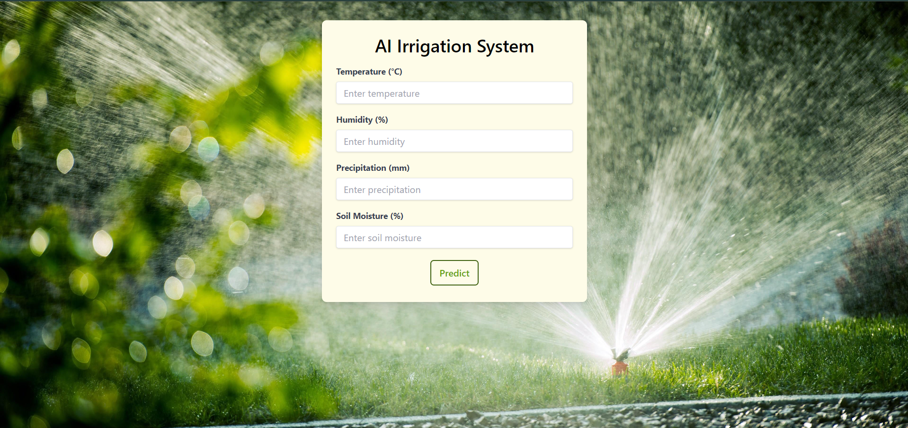
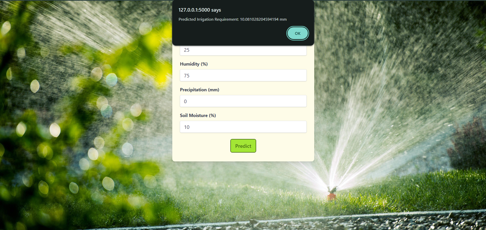

# AI Irrigation System




## Overview

The Smart Irrigation Predictor is a system designed to optimize water usage and resource allocation in agricultural settings, with a specific focus on tea estates. By analyzing real-time environmental data such as temperature and rainfall patterns, the system predicts irrigation requirements, leading to improved resource efficiency and reduced costs.

## Key Features

- Predicts irrigation requirement based on environmental data.
- Enhances water usage efficiency and resource management.
- Suitable for agricultural settings, particularly tea estates.

---

## Installation

1. Clone the repository:

   ```bash
   git clone https://github.com/RiddhiRaj/ai_irrigation_bg.git
   ```

2. Navigate to the project directory:

   ```bash
   cd ai_irrigation_bg
   ```

3. Create a virtual environment:

   ```bash
   python -m venv venv
   ```

4. Activate the virtual environment:

   - **For Windows**:
     ```bash
     venv\Scripts\activate
     ```
   - **For macOS/Linux**:
     ```bash
     source venv/bin/activate
     ```

5. Install dependencies:

   ```bash
   pip install -r requirements.txt
   ```
   ```bash
   npm install
   ```

---
## Usage

1. Run the application:

   ```
   python app.py
   ```

2. Access the application via web browser:

   ```
   http://localhost:5000
   ```


## Acknowledgements

- Joint project by [Aishee Guha Biswas](https://github.com/aishee06) and me.

---

Feel free to customize this template with additional sections or information specific to your project.
